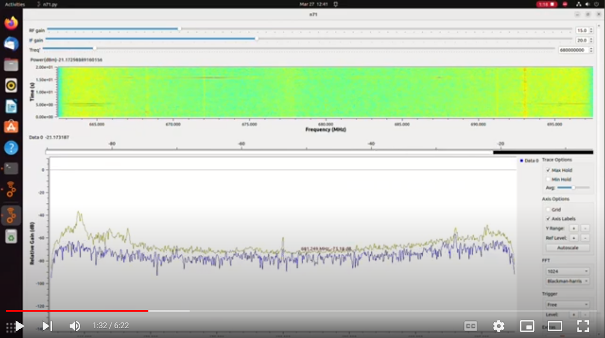

# 5G IoT Gateway with RF Measurement Capability
A measurement platform to test 5G networks

## Demo Video
I'm no youtuber but here is a video of the current state of the device as of March 2023

## Directions
* Use RPI Imager
* Instal Ubuntu Desktop 22.04.1 LTS (64-Bit)
* Write to SD Card
* Install SD card, plug in, and follow prompts to start up the Pi
* Go to 9 dots on bottom left > settings
* Power > Screen Blank > Never
* Users > Unlock > Enter Password > Automatic Login > Turn that on
* Open the command line and enter the following
* sudo apt-get install git
* git clone https://github.com/andrew153d/5G-IoT-Gateway.git
* cd 5G-IoT-Gateway
* nano setup.sh
* change the 5GModem variable to your modem > save and exit editor
* chmod +x setup.sh
* ./setup.sh
* A purple box will come up, select lightdm and hit enter
* The first item to install is vnc, you will need to type your pasword a few times here
* After vnc installs, it will take ~30 minutes

## To run the Website
* cd ~/5G-IoT-Gateway/website
* python3 inerface.py
* In a browser, go to ipaddress:5000

## Issues
* Currently bladeRF-cli does not work
** Installing bladerf from source overwrites bladerf-cli with an incompatible version

* Ubuntu ppa bladerf_lib.h is out of date not including bladerf_feature keeping gr-bldaerf from compilng
** Need to install correct version while also installing python module
